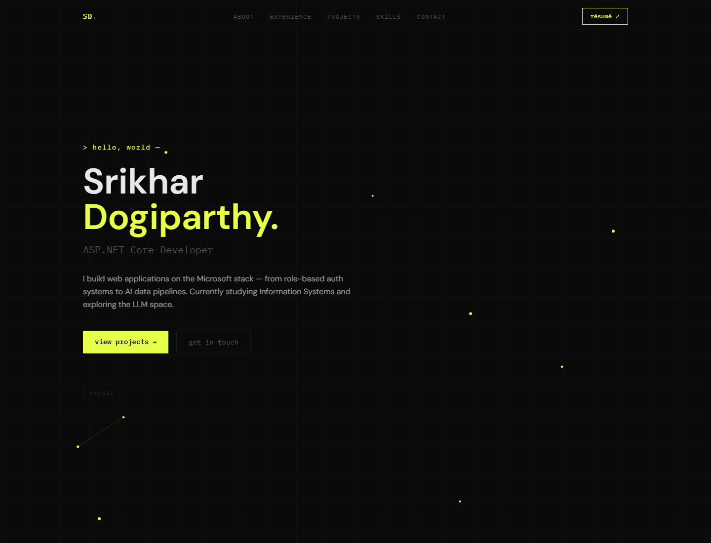

# Srikhar Dogiparthy Portfolio

Personal portfolio built with Next.js, TypeScript, and Tailwind CSS. It highlights my work across full-stack .NET applications, AI/RAG systems, data-focused tools, and internship experience.

## Screenshots



## Tech Stack

- Next.js 14
- React 18
- TypeScript
- Tailwind CSS

## Features

- Animated hero section with particle and honeycomb visual layers
- Project cards for .NET, AI, database, and mobile work
- Experience, skills, resume, and contact sections
- Responsive layout for desktop and mobile screens

## Getting Started

```bash
npm install
npm run dev
```

Open `http://localhost:3000` in your browser.

## Build

```bash
npm run build
```
